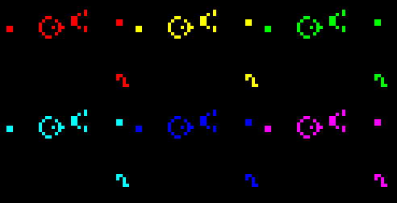

g--
title: Game of Life
date: 2025-2-12 16:45:00 +0800
categories: [cs61c, proj01]
tags: [notebook]
description: 20fall的cs61c的proj01是一个实现生命游戏的C语言程序，加深对指针的理解
pin: true
---

## Background
这个项目主要是将所给的 **.ppm**文件转换成一个 **.gif**动图来演绎**Game of Life**，这是一个由简单的规则展现极其复杂的最终结果的游戏

### PPM Format
在本项目中将用格式为P3的**PPM ASCII**文件(有其他五种格式)，其具体格式如下
```
P3
4 5 	//分别表示cols和rows，先列数后行数
255
  0   0   0     0   0   0     0   0   0     0   0   0
255 255 255   255 255 255   255 255 255     0   0   0
  0   0   0     0   0   0     0   0   0     0   0   0
  0   0   0     0   0   0     0   0   0     0   0   0
  0   0   0     0   0   0     0   0   0     0   0   0
```
第一行给出格式；第二行分别表示图像的列数和行数；第三行表示最大的比例，即表示我们的三种颜色值的范围是0~255；第四行到最后展示的是image，即图中每个像素(pixel)的R、G、B的数值大小。

## Project Main Body
### Part A1
A1部分相当于做一些准备工作，首先**Color和Image**两个结构体已经给出定义在头文件中如下
```
typedef struct Color 
{
	uint8_t R;
	uint8_t G;
	uint8_t B;
} Color;
typedef struct Image
{
	Color **image;
	uint32_t rows;
	uint32_t cols;
} Image;
```
我们要完成的是从一张**Image**结构中读取图像信息、打印图像信息到**stdout**以及释放指针对应内存，这一块各个整形都用的是对应的uint，这是一种无符号整形，与int的区别是其位数不随系统变化而变化，如**uint32_t**就始终是32位的无符号整形

对文件进行操作要明白必要的函数的用法
```
//这是定义文件指针指向对应的文件，第一个参数即相对于工作目录的文件名称字符串，第二个参数
//即表示读取的模式，如"r"只读还有"w"和"a"等
FILE *fp = fopen("diary.txt", "r");

//从指定文件指针处读取文件内容，这和scanf差不多，都有对应的占位符和对应地址
//如下的buf是字符串，自然只需要放个变量名即可表示地址，而num加个&才能表示其对应地址
fscanf(fp, "%s %d", buf, &num);

//在完成指针操作后关闭该指针，也即释放指针所占的内存
fclose(fp);
```
在写这部分代码时遇到过几个点：
1. 输入输出时uint32_t对应的占位符是%u，而uint8_t对应的占位符是%hhu
2. 函数对应的类型都应该是指针类型的，如`Image *readData(char *filename)`，因为结构体变量就像数组一样，名字只是个地址，不能用单纯整数赋值的方式进行函数调用
3. 格式，格式，格式，这里跟PTA一样，在完成writeData()函数的时候，每行的结尾不能有多余空格

### Part A2
完成转换对应像素为黑或白，其规则在说明文件中有，这里不赘述

跟A1部分有很多重合的点，在完成过程中多出的一个注意点在于
```
for(uint32_t i = 0; i < r; i++)
	{
		clr[i] = (Color *)malloc(c * sizeof(Color));
		for(uint32_t j = 0; j < c; j++)
		{
			clr[i][j] = *evaluateOnePixel(image, i, j);
		}
	}
```
这是将新的**Color**指针完善的过程，对于每一个cell进行转换，调用刚刚写过的evaluate函数，但是这样有一个问题，在调用之后相当于完成了指向地址的变化，那么中间的地址就丢失了，但是堆上内存中还有，讲清楚一点可以如下所示
```
for(uint32_t i = 0; i < r; i++)
	{
		clr[i] = (Color *)malloc(c * sizeof(Color));
		for(uint32_t j = 0; j < c; j++)
		{
			Color *c = evaluateOnePixel(image, i, j);
			clr[i][j] = *c;
			free(c);
		}
	}
```
将这过程展开就知道，上一个版本中的"c"丢失了，没有free掉造成堆上内存泄露，所以需要培养的好习惯就是**不连续调用函数以防止这样的内存丢失情况**，而检查内存丢失的过程可以由**valgrind**完成

### Part B
过程和A2其实差不多，尤其是life函数与A2的一个函数几乎无二，有两个好的思想，分别一是这里的direction数组来表示8个方向的思想，二是将rule作为一个16进制输入来简化输入，而输入后转化为10进制并用位操作来展现8个邻居的状态

## Congratulation!
到这里20fall的proj01就结束了，最后放一张用csh脚本convert出来的gif动图来标志这个项目的结束


