临近期末开始了这个项目，由于是用**logisim**这个开源软件完成的整个过程，所以并没有什么太多的代码成分，但在完成的过程中无疑对之前的很多学习有一个运用，比如各种指令格式在完成立即数生成器的时候起到关键作用等，现在写下这篇文章主要为了记录整个的完成过程、整个项目的结构以及运用到的前置知识等

首先说明一下整个项目的结构，进入到`FA20-proj3-starter`中，会有三个主要目录分别为`cpu`、`harnesses`以及`tests`，前两个目录中主要包含的都是`.circ`文件，用`logisim`打开就是完成的电路图，主要实现了**CPU、ALU、立即数生成器、内存、寄存器文件等**，个中包含关系也用到了抽象的逻辑思维，如`cpu`文件中将其他的电路图作为子电路运用起来，在第一个目录`cpu`中，实现了硬件部分，并有总`cpu`电路将这些汇总；在第二个目录`harnesses`中，存放了一些测试电路，`alu_harness`和`regfile_harness`分别对应前两个`task`的测试电路，`run.circ`中调用`test_harness.circ`来完成测试，而后者由调用`cpu.circ`文件来完成测试，这就是**Part A**的全部结构

## Part A
> Part A分为三个过程，分别是`task 1`的ALU的实现，`task 2`的RegFile的实现以及`task 3`分别实现单周期CPU完成`addi`的操作以及优化为二级流水线来完成`addi`的操作

### Task 3: The `addi` instruction
`addi`指令需要用到立即数，而不需要用到内存，通用的CPU流水线分为五个阶段：
1. Instruction Fetch(IF)
2. Instruction Decode(ID)
3. Execute(EX)
4. Memory(MEM)
5. Write Back(WB)

现在先讨论第二阶段解码阶段如何解码，这里关键在于各种指令格式的选取和解读，指令格式分为
- R-Format
- I-Format
- S-Format
- B-Format
- U-Format
- J-Format

**R-Format的指令格式如下：**
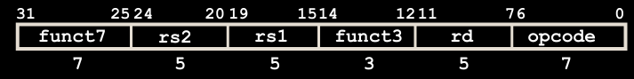

其中**rs1,rs2和rd**分别表示两个源寄存器和目标寄存器，均只用占用5bits，opcode占用7bits用于表示不同的指令格式，而R-Format指令用于表示**Reg-Reg OP**，其opcode表示为**0110011**，**funct3和funct7的不同组合用于表示不同的R格式操作如add、sub、xor等**，举例如`add x4, x3, x2`的正确编码的十六进制格式就是`0021 8233`

**I-Format的指令格式如下：**
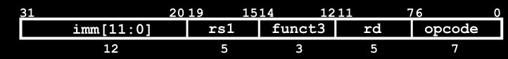

相比于R格式而言引进了立即数的概念，即把`rs2`改造为立即数，但如果保留原格式的话只有5bits来表示立即数，只能涵盖32位的数值，因此将funct7也加入形成了I-Format，其opcode表示为**0010011**，由于这种格式需要表示的逻辑算术运算只有9个，因此只需要一点点对原funct7位置的改造即可

除去逻辑和算术左移右移运算，其他的逻辑算术运算可以用到全部的imm位，而左移右移都只需要5bits来表示32位的移动就绰绰有余，因而只需要低5bits，而高7bits将根据不同种类的移位来分类，为了更加直观，直接给出下图
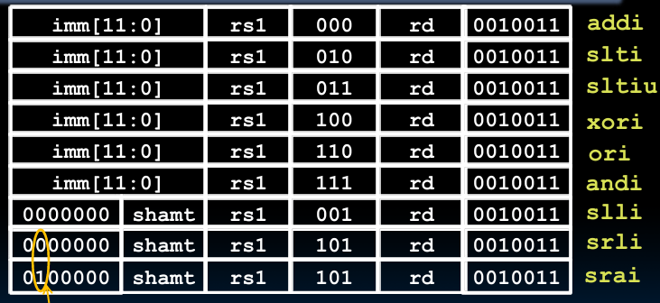

同时I-Format还可以用于表示`load`指令，而imm位存储的是偏移量`offset`，其表示的和`addi`很像，用rs1中存储的基地址加上偏移量来表示内存中的真实地址，以此来加载具体值放进rd寄存器中

```
lw rd, offset(rs1)
```

指令格式上也有所不同，`opcode`有所改变，表示为**0000011**，**funct3**的不同组合用于表示不同的加载指令如**lb,lh,lw,lbu,lhu**，具体指令如**lw x14, 8(x2)**

**S-Format指令格式如下：**
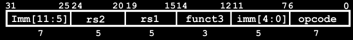

```
sw rs2, offset(rs1)
```

和**load**指令相同的是，都是用**rs1**作为基址来找内存中的位置，不同的是加载指令是从内存中取出值加载到寄存器中，所以用到`rd`寄存器，而store指令对应的是存储在目标内存地址中，所以原`rd`的位置对应立即数的低5位，加上在最高位的7位组合为12为立即数，根据基址rs1的位置将rs2的数据存储到对应内存地址中，这一格式只有**sb, sh, sw**这三个指令，对应opcode为**0100011**

**B-Format的指令格式如下：**
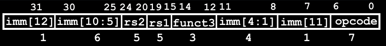

这一类的指令通常用于循环中，格式大致如`beq x1, x2, label`表示两个值相等则跳转至label处，其opcode表示为**1100011**，虽然这个格式极为复杂，但是大致结构却与store格式相似，只是imm细分更多，当我们计算这个指令时，往往先将label对应的代码段地址与当前PC值作差算出偏移量，**再舍其第0位**，最终将完整的数据(即包含最低位为0的数据)加到PC上进行更新，这是因为RISC-V中的指令至少是2字节对其的，虽然现在看到的指令都是四字节对齐，但是RISC-V中有RVC的压缩指令集，为了包含所有的指令，故而选取2字节为跨度，所以第0位往往都是0，自然不用计入

**U-Format的指令格式如下：**
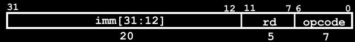

这个格式只有**lui和auipc**两个指令，前者是将这20位设置在`rd`的高20位，并将低12位清零，后者是将高20位设置后再加上本指令的PC值

对于`lui`有一个注意点，如下
```
lui x10, 0xDEADB
addi x10, x10, 0xEEF
```
由于addi会将立即数的最高位扩展至32位，所以这个加完的结果不是想象中的`0xDEADBEEF`而是`0xDEADABEEF`，如果想达到预期结果只有在lui的时候手动加上1变成`lui x10, 0xDEADC`，为了应对这复杂情况，设计了伪指令`li`，直接完成预期的操作，`li x10, 0xDEADBEEF`来直接加载立即数。

**J-Format的指令格式如下：**
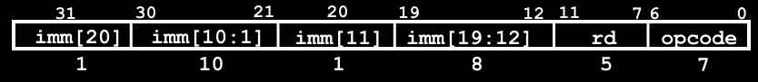

这一格式只有`jal`这一个指令，将**PC+4**保存在`rd`寄存器中并跳转到label处

**总结格式大全如下**
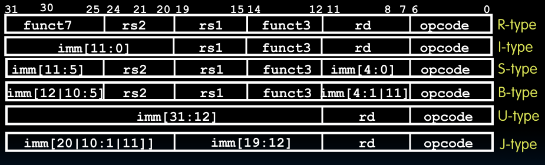

现在可以开始进行`addi`指令的数据路径编写，先完成单周期CPU版本的，先用
```
java -jar logisim-evolution.jar
```
打开logisim，在各个`.circ`文件中，都有`pin`端口表示输入或者输出，一般将其连接到本`.circ`文件中的通道中开始这个子电路的运行，这里暂且不论是如何将`.s`中的汇编指令转换为logisim中的输入的，只需要知道测试文件会给出三个指令的01序列作为输入来检测我们的各个输出是否符合给定的输出结果

接下来不论是单周期CPU还是流水线的运用，都无法离开CPU运行阶段的分类，在这里大致介绍如下
1. Instruction Fetch(IF)
2. Insturction Decode(ID)
3. Execute(EX)
4. Memory Access(MEM)
5. Write Back to Register(WB)

#### single
先来讨论对于单周期CPU的编写

在一开始，不是指令的直接输入，而是从PC的复位开始，在logisim中置其为0x0000的初始地址，然后将这个初始地址输出到IMEM中读取该地址中的具体指令信息再重新传入CPU中，这个时候PC应该同时完成了+4(或者分支的地址增减)操作，等到下一个时钟信号上升沿进行PC的更新以及下一个指令的寻找，此时的寄存器是最简单的形式，因为暂时不用考虑分支和跳转的实现，示意图如下
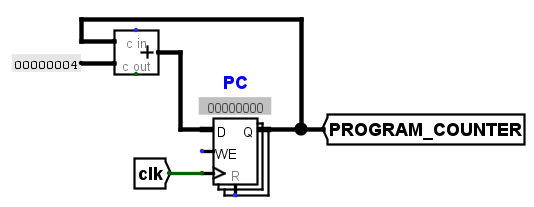

右边的`PROGRAM_COUNTER`就是传出的地址，用于传入`IMEM`中得到具体指令

至此算是**CPU运行的五大阶段的第一阶段IF**的完成

第二阶段的ID，主要有解码和regfile的读取两部分，前部分在`addi`的实现中较为简单，就是一个组合逻辑电路，将`INSTRUCTION`按照`addi`的`I-type`解码，图示如下

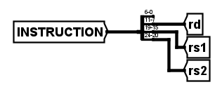

而regfile中的读取实现起来也不难，但这里着重讲一下`regfile`本身，先看子电路的调用示意图如下
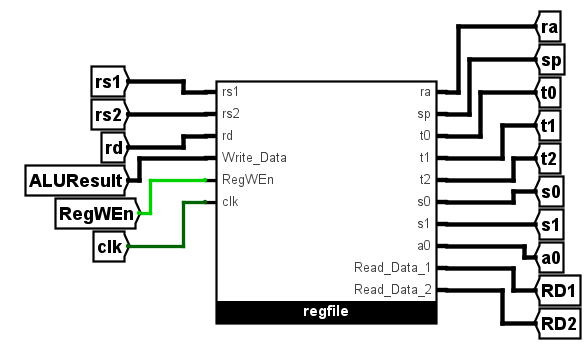

看上去是一个逻辑上较为同步的组合逻辑电路，但是实际上有一个不那么同步的输入端`Write_Data`端，它表示的是rs1和rs2(也可能是立即数)的指令运算结果，即要存入`rd`中的具体值，其是否写入`rd`受`RegWEn`的控制，这是一个来自控制单元的输入，在`addi`中确实是要写入寄存器的，所以在这一阶段只需要将其置1即可，实现上将其在控制单元中连接到一个常数1即可

可以从初始阶段讲起，当开天辟地的第一个时钟信号`clk`上升沿出现时，前面说的PC端会进行复位，指向第一个要执行的指令，而这里的时钟信号表示的是写入`rd`，而因为此时没有`RegWEn`的输入所以不作为，等到前面的信号传入过来时，虽说`rd`也一并传入了，但是只有在`clk`的上升沿才会进行寄存器的读入操作，而读取操作并不需要时钟信号，所以`rs1`和`rs2`的读取实际上一直都是一个函数式的读取任务，在后面`ALU`的运算结束后，`ALUResult`会传入到`Write_Data`端，等到下一个即第二个时钟信号上升沿出现时，完成写入操作，这个时候第二条指令还在获取阶段，所以全然不用担心冲突问题

至此**第二阶段ID阶段**完成了

第三阶段是执行阶段，也就是传入`ALU`进行运算，这里利用4位选择信号`ALUSel`来选择具体的指令操作进行运算，在这里`addi`对应的加法操作即`0000`，至于第四阶段对内存的操作，由于`addi`指令不涉及所以可以在此省略，直接到第五阶段的写回操作，即让`ALUResult`连接回`regfile`等待下一个时钟信号上升沿的出现完成一个轮回的运行

值得一提的是，在`regfile`读取了两个源寄存器的值之后，并不是直接连接到`ALU`上的，就以`addi`作比方，它不是寄存器之间的加法而是一个寄存器和一个立即数的加法，所以在这里还要进行一个选择，而对于`rs1`在后续也会有其对应的选择，这里给出`rs2`的选择示意图

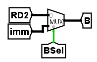

上图中`imm`来源于立即数生成器，即开篇花了较多笔墨讲解的一个东西，虽从重要性角度来看没必要放这么前，但这是笔者的思路过程，就不多作排版了

#### 2-stage pipeline
将5个阶段分为两个阶段，第一个阶段是IF阶段，而第二个就是剩下的所有阶段，而具体实现上也较为简单，只需要添加一个流水线寄存器，也就是如下图所示的寄存器，将其替换掉之前的`INSTRUCTION`解码部分即可

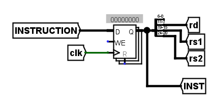

该寄存器用于存放第一阶段结束后获取到的指令，从而能够在下一周期的时钟上升沿再开始下一步的解码操作，需注意传入后面阶段的指令不是`INSTRUCTION`而是`INST`，否则流水线寄存器的存在将没有意义

至此我们完成了PartA的所有操作，由于只适用于`addi`一个操作所以有较多不普适的地方，这些将在PartB中得到完善

## PartB

### Task 4
在这里我们将完成所有指令在CPU中运行的数据路径以及编写控制逻辑从而对指令经过的数据路径进行控制，这种控制像是一种逻辑的选择，在这里我们直接进入将整个指令分为IF以及后续的EX阶段的二级流水线，相较于`part_a`中的二级流水线，这里把`PC`的输出值也进行了流水线寄存器的存储，其实这一步骤在`part_a`中也应该进行，但是`part_a`中因为只有`addi`的指令，所以侥幸通过了测试

让我们来看看相较于`part_a`增加了哪些东西

首先为了允许`load`和`store`指令的执行，我们必须要加上对`DMEM`的操作，即将`rs2`的读取结果`RD2`传入`WRITE_DATA`中表示`store`时存入数据内存中的值，以及`ALUResult`存入`WRITE_ADDRESS`来表示`load`和`store`中读取或者存储的内存地址，这是`ALU`中计算的基址和偏移量得出的地址，具体是读取还是写入则由控制信号`MemRW`来决定，其宽度为2bits用于表示读，写还是无操作

接下来要实现分支的兼容，主要在于`PC`的下一状态是`PC+4`还是**跳转的地址**，在这条指令中我们多出了三个东西，分别是**由PCSel控制的选择PC+4还是新地址的数据选择器、用于比较rs1和rs2的值的大小的分支比较器和由Asel控制的数据选择器**，对于这个指令，多了两个输入到**控制逻辑单元**的输入，`BrLT`和`BrEq`用于表示具体的大小关系。指令执行到`ID`阶段解码后会产生除了`PCSel`以外的所有控制逻辑，因为需要`BrLT`和`BrEq`的输入才能知道是否要跳转到指定地址，所以将等待到分支比较器的结果产生之后再由控制逻辑单元第二次产生控制逻辑以实现最后的是否跳转

最后对于`JAL`和`JALR`这样的跳转，虽然分别属于`J-type`和`I-type`，但是都需要在`rd`中存储跳转前的下一个地址即`PC+4`，所以需要在`WB`阶段的数据选择器中加一个选项即`PC+4`是否选择，这里我们将运输`PC`的值而不是`PC+4`的值，因为如果选择后者则需要在每一个流水线寄存器存储一遍，所要的消耗大于最后在数据选择器前进行+4运算

至此我们完成了数据路径的所有编写操作，在所有的实现中关于`control_logic`中ROM的设置是一个问题，现在考虑到的解释是通过某种表格导入进去，如果一个一个自己设置有点dirty work的感觉，所以为了方便直接复制的别人的ROM进来，属于全篇唯一一个非自己实现的部分，但涉及的知识点不多，所以没什么关系，这部分的解释是，传入地址、`BrEq`和`BrLT`形成一个12位的地址，在ROM中通过地址来找到对应的20bits的值，这个值拆开来就可以表示最后的20位控制逻辑

但如果只是这样的话，是无法通过测试的，这是因为在这里的流水线中，会产生**Control hazard**，大概描述为，在分支语句的解码过程中，因为暂时不知道分支语句是否要进行跳转的时候下一个语句已经开始读取阶段了，如果分支要进行跳转则显然下一指令是错误的指令，对此我们的解决方案最简单的是`bubble`，即用一个无意义的语句`Nops`(在这里解码为`addi x0, x0, 0`)，即`0x00000013`，来更新当前的指令，图示如下

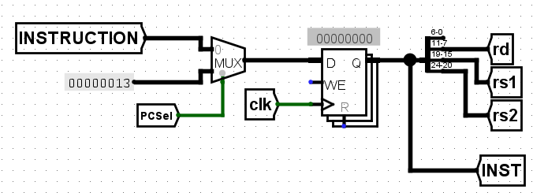

到这里我们就真正地通过了所有task4的流水线测试，虽说这个项目差不多到这就结束了，但是距离讲座上的**五级流水线、流水线寄存器寄存控制逻辑状态以及超标量处理器等**概念还是未得到充分实践，但是也加深了对CPU内部细节的理解

