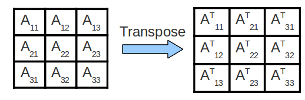

## Cache

## Lab07
### Exercise 1
`cache.s`是一个汇编文件，其内容大致为伪代码如下
```
# PSEUDOCODE:
#    int array[];  //Assume sizeof(int) == 4
#    for (k = 0; k < repcount; k++) {		// repeat repcount times
#      /* Step through the selected array segment with the given step size. */
#      for (index = 0; index < arraysize; index += stepsize) {
#        if(option==0)
#          array[index] = 0;			// Option 0: One cache access - write
#        else
#          array[index] = array[index] + 1;	// Option 1: Two cache accesses - read AND write
#      }
#    }
```
在cs61c的根目录中输入命令`java -jar tools/venus.jar . -dm`从而运行cs61c目录下的`tools`目录中的`venus.jar`文件，将其和网页中的`venus`连接，根据终端生成的要求将对应指令复制到`venus`网页终端中进行连接

在练习一中，给出三个场景，即不同的`a0, a1, a2, a3`以及不同的`cache`参数，来观察对应的命中率和运行过程，从而回答对应的`task`问题

具体参数解释如下
```
a0	给定的数组字节数
a1	步长，即内部循环中index一次加多少
a2	外层循环次数
a3	option选项，为0则将数组中当前下标元素赋0，为1则将当前下标元素++
s0 	每次递增4 * a1表示内存中指向当前下标元素的指针
s1	性质同s0，但表示最大数组下标指针

Block size(bytes)	表示一个缓存块有多少字节，offset位数也根据这个求出
Associativity		表示相联度，即一组中有多少缓存块，如在直接映射缓存中是固定值1，全相联中则是固定的缓存块个数
```

#### Scenario 1
> 在这里不赘述具体参数设置为多少，只记录一些关键点

第一个情景中设置步长为8，换算为十六进制即`0x000000020`，即在内存中每一步都将`s0`递增`0x00000020`，换算为32为bits即后六位为`0x100000`，而本情景的设置中块大小为8，而块个数为4，决定了`offset`为3位而`index`为2位，所以每次递增都不会改变`index`的值为`00`而递增`tag`的值，所以将不断`miss`缓存块的第一块，使得`hit rate`持续为0

该如何修改参数使得缓存命中率提高？答案是缩短步长为1，其中间值不论是2还是4都会出现不断miss的情况，只有取1的时候会开始命中一次再更新一次

#### Scenario 2
这一个情景中步长为2，换算为字节即8bytes，而块大小为16bytes，这代表了两次迭代才会到下一次要更新的时候，而`option`选为1，所以我们为了完成`arr[i] = arr[i] + 1`的操作需要一读一写，即一次`lw`和一次`sw`，所以一次迭代中会有两次对内存(在这是对缓存)的操作，所以在一整个流程中，往往是有一次的初始缓存为空导致的未命中和后面紧接着的三次命中，整体采用组相联缓存，因而在缓存足够的情况下会是刚好的`75%`的命中率，而256bytes的缓存空间刚刚好可以满足缓存足够

并且我们可以发现，由于所有要访问的内存数据都已经缓存，所以如果`repcount`设置为趋近于无穷大，命中率将无限接近于1

#### Scenario 3
加入了二级缓存即`L2 Cache`，实际命令在运行时会先在`L1 Cache`中找寻目标数据，如果没找到则往后找`L2 Cache`中是否存在，若存在，则将其复制到`L1 Cache`中并使用，若不存在，则继续往后在主存中找到数据，并分别存入`L1 Cache`和`L2 Cache`中

在本次情景中，初始只设置了`repcount`为1，所以即使`L1 Cache`有百分之五十的命中率，`L2 Cache`由于一开始都是空的，所以虽然存入很多数据，却只有百分之0的命中率，因此若想提升L2的命中率，只需要增加循环次数即可，而在这个过程中`L1 Cache`的命中率并无变化，因为一个循环中对`L1 Cache`进行了两次写入，所以当进入下一个循环后又需要进行更新，故命中率保持不变

### Exercise 2
本练习使用`make`语句完成`makefile`中`ex2`的运行，输入语句`make ex2`即可运行，执行`matrixMultiply.c`文件从而实现矩阵乘法，并对其执行时间进行监听，我的执行结果为
```
ijk:    n = 1000, 3.379 Gflop/s
ikj:    n = 1000, 2.385 Gflop/s
jik:    n = 1000, 3.333 Gflop/s
jki:    n = 1000, 14.472 Gflop/s
kij:    n = 1000, 2.402 Gflop/s
kji:    n = 1000, 14.521 Gflop/s
```
字母排序顺序为从外层到内层的循环顺序，内层执行语句始终为`C[i+j*n] += A[i+k*n]*B[k+j*n]`，本练习采用列主序存储方式，即将二维矩阵压缩为一维时先存储完一列后才会接着存储下一列，所以有`i + j * n`这样的索引方式

可以发现`jki`和`kij`的顺序效率最高，这是因为在最内层中只有`i`步长为1，其他的`k`和`j`均有步长为n的时候，如`C[i + j * n]`中，i步长为1而j步长为n

### Exercise 3
本练习出于**若矩阵过大，以至于大于缓存大小，在转置时会发生大量的容量未命中的情况**来实现一个分块转置的算法`Cache Blocking`，算法的想法图如下



具体算法实现和原转置算法如下：
```
/* The naive transpose function as a reference. */
void transpose_naive(int n, int blocksize, int *dst, int *src) {
    for (int x = 0; x < n; x++) {
        for (int y = 0; y < n; y++) {
            dst[y + x * n] = src[x + y * n];
        }
    }
}

/* Implement cache blocking below. You should NOT assume that n is a
 * multiple of the block size. */
void transpose_blocking(int n, int blocksize, int *dst, int *src) {
    for(int sx = 0; sx + blocksize <= n; sx += blocksize) { 
    //设置的循环条件为bx + blocksize <= n，
    //可以相等是因为bx + blocksize是边界值，在内测两个循环中属于不可到达的边界，即大小值，
    //所以在遍历找边界的时候是要到达的
        for(int sy = 0; sy + blocksize <= n; sy += blocksize) {
            for(int x = sx; x < sx + blocksize; x++) {
                for(int y = sy; y < sy + blocksize; y++) {
                    dst[y + x * n] = src[x + y * n];
                }
            }
        }
    }

    if(n % blocksize == 0) return ;

    int ex = (n / blocksize) * blocksize;
    int ey = (n / blocksize) * blocksize;

    for(int x = ex; x < n; x++) {
        for(int y = 0; y < ey; y++) {
            dst[y + x * n] = src[x + y * n];
        }
    }

    for(int x = 0; x < ex; x++) {
        for(int y = ey; y < n; y++) {
            dst[y + x * n] = src[x + y * n];
        }
    }

    for(int x = ex; x < n; x++) {
        for(int y = ey; y < n; y++) {
            dst[y + x * n] = src[x + y * n];
        }
    }
}
```
